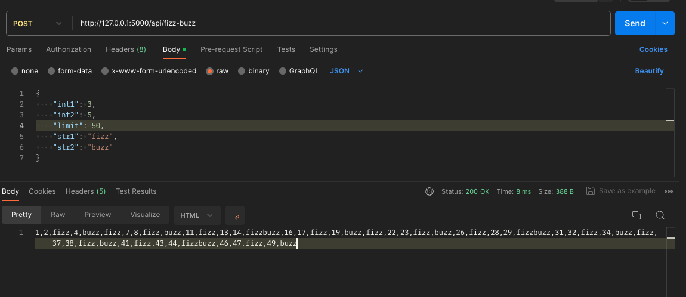
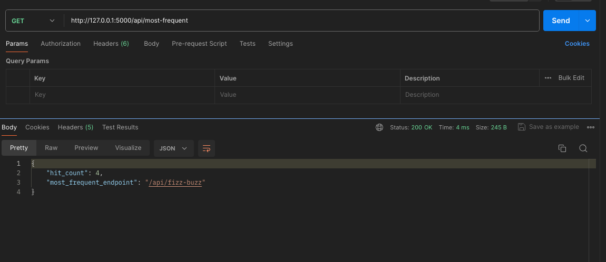

# Fizz-Buzz-REST-API
## Tech Stack

**Server:** Python

## Third party library used
  **flask:** To create endpoints with help of `route` in flask
  
  **flask_cors:** This module helps in cors enabling or disabling for an origin

  **dotenv:** To read the system and server variables

  **marshmallow:** This module is used to validate payload of incoming request

## Execution

To start the app, run the following command

```bash
  python server.py
```
Run the curl in postman(or any)
```
curl --location http://127.0.0.1:5000/api/fizz-buzz \
--header 'Content-Type: application/json' \
--data '{
    "int1": 3,
    "int2": 5,
    "limit": 50,
    "str1": "fizz",
    "str2": "buzz"
}'
```

Response:
```
1,2,fizz,4,buzz,fizz,7,8,fizz,buzz,11,fizz,13,14,fizzbuzz,16,17,fizz,19,buzz,fizz,22,23,fizz,buzz,26,fizz,28,29,fizzbuzz,31,32,fizz,34,buzz,fizz,37,38,fizz,buzz,41,fizz,43,44,fizzbuzz,46,47,fizz,49,buzz
```


Also, you can get the max hits count of endpoints by 

```
curl --location http://127.0.0.1:5000/api/most-frequent
```


## Run Unit Test
To Run the test, run the following command
```bash
  python -m unittest test_endpoints.py
```